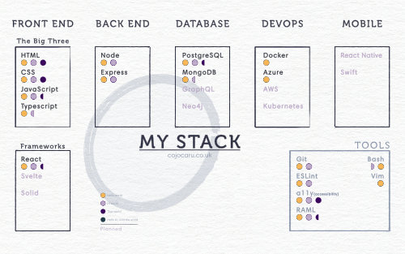

**Hi there, I'm...**

# IONUT COJOCARU

**A JavaScript developer currently focusing on the MERN stack.**

Once I'll get this flying, next on my list are Python, Rust, WebAssembly.

---

There's a lot going on here, including the beginnings of a procedurally generated ecosystem! Think of a mad scientist in his early days, just as he was getting into the mad science stuff. Crazy, right? Well, I always thought that programming is modern-day alchemy, in a world where alchemy is real. You can do anything, and change anything into anything else, just with some written symbols.

That's why I am making public only the things that are already published or are safe to see the light of day.

---

---

## One, two, PITCH:

***My approach is varied and flexible; I don't shy away from experimenting with the new and learning the why behind the written code.***

***Always curious, my aim to explore, excel and deliver.***

***My guiding principle is complexity hidden in simplicity.***

***My previous experience, as an ecommerce business owner for almost decade, has offered me the opportunity to develop and perfect a wide range of soft skills.***

More about all this in my [resume](https://ionut.cojocaru.co.uk/static/media/Ionut%20Cojocaru%20-%20Resume.09c064535e27c5121c39.pdf) and my [portfolio](https://ionut.cojocaru.co.uk/).

---

## My Current Stack

---

## Links

[My portfolio](https://ionut.cojocaru.co.uk/), including a fine tuned OpenAI model meant to impersonate me and answer interview questions on my behalf (or maybe, who knows, my attempt to gain immortality in the cloud).

[The Riddle Fiddle](https://riddles.artifices.xyz/), a text-based riddle-solving word-guessing game with AI generated imagery and a friendly hints algorithm.

[My docs](https://docs.cojocaru.co.uk/welcome/), where you can find all that you want, and more, about my methods and documentation process.

And finally, my passion project, [Artifices](https://www.artifices.xyz/), which focuses on storytelling and modest attempt at discovering board game mechanics, and which will get a complete overhaul soon enough.

Here are my [PluralSight](https://app.pluralsight.com/profile/ionut-cojocaru-f3) test scores.

---

Social

I'm not a big fan of social media, and I use it only if absolutely necessary. Here is my [LinkedIn](https://www.linkedin.com/in/ionut-cojocaru-dev/) profile, and my [Twitter](https://twitter.com/Ionut_Dev), which I use solely to document my 100 Days of Code challenge.

---
