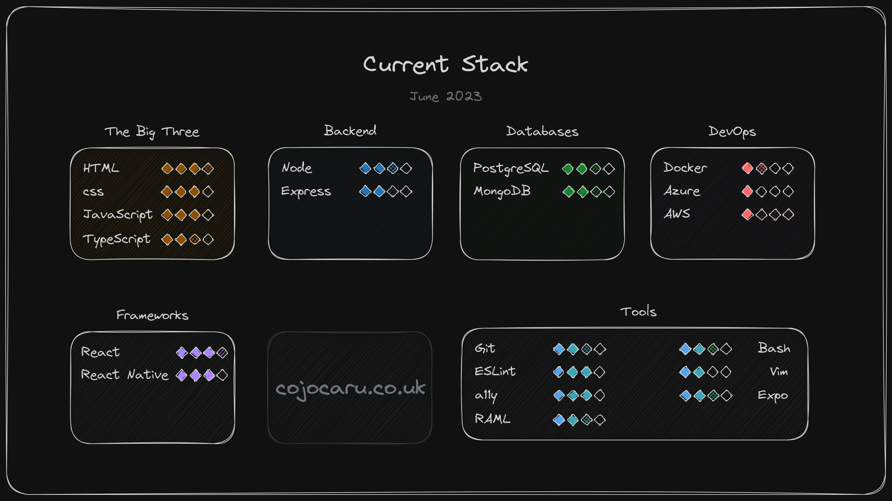

**Hi there, I'm...**

## IONUT COJOCARU
*[yo-noots ko-zho-ka-roo]*

**A Typescript developer currently focusing on the backend and cloud technologies...**

**...with a sprinkle of Golang and Python.**

***

**Working in:**
- **React**
- **NextJS**
- **React Native**
- **Hugo**

---

## Why coding?

I believe that this is the closest time in human history that we got to practicing magic. And the craziest part is that it all happens by simply manipulating some written symbols. 

Add to this rather cosmological view the simple pleasure of craft things--for others to use, or simply for the pleasure of doing it.

---

---

## One, two, three, PITCH!

***My approach is varied and flexible; I don't shy away from experimenting with the new and learning the why behind the written code.***

***Always curious, my aim to explore, excel and deliver.***

***My guiding principle is complexity hidden in simplicity.***

***My previous experience, as an ecommerce business owner for almost decade, has offered me the opportunity to develop and perfect a wide range of soft skills.***

<!-- More about all this in my [resume](https://ionut.cojocaru.co.uk/static/media/Ionut%20Cojocaru%20-%20Resume.02b426b71b7b406496cb.pdf) and my [portfolio](https://ionut.cojocaru.co.uk/). -->

---

<!-- ## My Current Stack

 -->

---

## Some Useful Links

[My portfolio](https://i-co.xyz), which doubles as a personal website
 <!-- including a fine tuned OpenAI model meant to impersonate me and answer interview questions on my behalf (or maybe, who knows, my attempt to gain immortality in the cloud). -->

[Alice's Nightmare in Wonderland](https://alice.i-co.xyz), a digitization of the eponymous game book by Jonathan Green

[Konvertor](https://apps.apple.com/gb/app/konvertor/id6450120315), the smartest unit conversion app out there. Live on the App Store.

[The Riddle Fiddle](https://riddles.i-co.xyz), a text-based riddle-solving word-guessing game with AI generated imagery and a friendly hints algorithm.

<!-- [My docs](https://docs.cojocaru.co.uk/welcome/), where you can find all that you want, and more, about my methods and documentation process. -->

<!-- And finally, my passion project, [Artifices](https://www.artifices.xyz/), which focuses on storytelling and modest attempt at discovering board game mechanics, and which will get a complete overhaul soon enough. -->

<!-- Here are my [PluralSight](https://app.pluralsight.com/profile/ionut-cojocaru-f3) test scores. -->

---

Social

For better of worse, I'm not a big fan of social media. But I do have a [LinkedIn account](https://www.linkedin.com/in/ionut-cojocaru-dev/).

---
